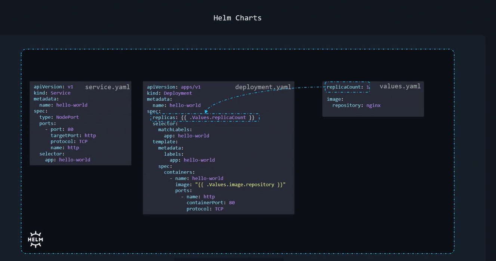

# Helm Study Notes

## Helm2 vs Helm3

### Tiller in Helm2
- **Tiller Component**: 
  - Helm2 relied on a server-side component called **Tiller** deployed in the cluster.
  - Tiller was responsible for managing releases (installing/upgrading/deleting charts).
  - **Security/RBAC Issues**:
    - Tiller required broad permissions in the cluster, often needing `cluster-admin` rights.
    - This led to security concerns, as Tiller's permissions were not scoped to specific namespaces or roles.
    - RBAC (Role-Based Access Control) configurations were complex and error-prone.
- **CRDs (Custom Resource Definitions)**:
  - Helm2 did not natively support CRDs as first-class citizens. CRD management required manual steps or hooks.

### Helm3: Removing Tiller
- **Tiller Removal**:
  - Helm3 eliminates Tiller, moving all logic to the client-side (`helm` CLI).
  - **Benefits**:
    - Simplified security model: Permissions align with the user's kubeconfig credentials.
    - No more RBAC challenges tied to Tiller.
- **CRD Handling**:
  - Helm3 treats CRDs as standard Kubernetes resources, allowing them to be managed directly in charts (with safeguards to prevent accidental deletion).

---

## 3-Way Strategic Merge Patch
- **What is it?**
  - Helm3 uses a **3-way merge strategy** during upgrades:
    1. **Last Applied Configuration** (the original state of the resource).
    2. **Current Live State** (the live state in the cluster).
    3. **New Changes** (the desired state from the updated chart).
  - This resolves conflicts more effectively than Helm2’s 2-way merge.
- **Why it matters**:
  - Reduces unexpected changes or data loss during upgrades.
  - Aligns with Kubernetes' native `kubectl apply` behavior for strategic merging.

---

## Helm Metadata Storage
- **Release Metadata**:
  - Helm stores metadata (e.g., release history, chart versions, values) **as Kubernetes Secrets** in the cluster.
  - **Location**: Secrets are created in the same namespace as the release.
- **Structure**:
  - Secrets are labeled with:
    - `owner: helm`
    - `status: deployed` (or `superseded`/`failed`).
  - Example Secret name: `sh.helm.release.v1.<release-name>.v1`.
- **Benefits**:
  - **Accessibility**: Secrets are accessible to all team members with namespace access.
  - **Security**: Secrets are encrypted at rest (if the cluster is configured for encryption).
  - **Auditability**: Full release history is stored and recoverable.
- **Helm2 vs Helm3**:
  - Helm2 stored release metadata in **ConfigMaps** (less secure).
  - Helm3’s use of Secrets aligns with better security practices.
```

### Example: Viewing Helm Secrets
```bash
# List all Helm secrets in a namespace
kubectl get secrets -l owner=helm -n <namespace>
```

---

# Helm Repositories, Charts, Releases & Common Commands

---

## Helm Repositories
### What is a Helm Repository?
- A **Helm repository** is a collection of Helm charts stored remotely (e.g., HTTP server, OCI registry) or locally.
- **Default Repositories**:
  - **Artifact Hub** (`https://artifacthub.io`): The primary public hub for Helm charts (replaced Helm Hub).
  - Others: Organizations often host private repositories (e.g., ChartMuseum, GitHub Pages, S3 buckets).

### Repository Storage Locations
- **Local Configuration**: Helm repositories are stored in your local Helm configuration (at `~/.config/helm/repositories.yaml`).
- **Example Repositories**:
  ```bash
  # Add the Bitnami repository
  helm repo add bitnami https://charts.bitnami.com/bitnami
  # List configured repositories
  helm repo list
  # Update local repo metadata
  helm repo update
  ```

---

## Charts vs Releases
### Charts
- **Definition**: A Helm chart is a packaged application containing Kubernetes manifests, dependencies, and metadata.
- **Structure**: A folder with files like:
  ```
  mychart/
  ├── Chart.yaml
  ├── values.yaml
  ├── templates/
  └── charts/ (dependencies)
  ```
- **Example**: `bitnami/wordpress` is a chart for deploying WordPress.

### Releases
- **Definition**: A **release** is a deployed instance of a chart with specific configurations.
- **Example**: Installing `bitnami/wordpress` with the release name `my-site` creates a unique release in the cluster.

---



## Most Used Helm Commands

### Installation
```bash
# Install a chart from a repo
helm install my-release bitnami/nginx

# Install from a local chart directory
helm install my-release ./mychart

# Install with a values file
helm install my-release bitnami/wordpress -f custom-values.yaml

# Install with inline overrides
helm install my-release bitnami/wordpress --set service.type=NodePort
```

### Upgrading Releases
```bash
# Upgrade a release with new values
helm upgrade my-release bitnami/wordpress -f updated-values.yaml

# Override specific values during upgrade
helm upgrade my-release bitnami/wordpress --set replicaCount=3

# Rollback to a previous version
helm rollback my-release 2

```

### Managing Repositories
```bash
# Add a repository
helm repo add bitnami https://charts.bitnami.com/bitnami

# List repositories
helm repo list

# Update repository metadata
helm repo update

# Search for charts in Artifact Hub
helm search hub wordpress

# Search in your configured repositories
helm search repo nginx
```

### Managing Releases
```bash
# List deployed releases
helm list

# Uninstall a release
helm uninstall my-release

# View release status
helm status my-release

# View release history
helm history my-release
```

---

## Example Workflow
1. Add a repository:
   ```bash
   helm repo add bitnami https://charts.bitnami.com/bitnami
   helm repo update
   ```
2. Install WordPress:
   ```bash
   helm install my-site bitnami/wordpress \
     --set service.type=LoadBalancer \
     --set mariadb.auth.rootPassword=secret
   ```
3. Upgrade with a values file:
   ```bash
   helm upgrade my-site bitnami/wordpress -f production-values.yaml
   ```
4. Clean up:
   ```bash
   helm uninstall my-site
   ```

---

To download the default `values.yaml` file of a specific Helm chart, use the `helm show values` command. Here's how:

---

### Command
```bash
helm show values [REPO_NAME]/[CHART_NAME] > values.yaml
```

### Example
```bash
# Download the default values for the `bitnami/wordpress` chart
helm show values bitnami/wordpress > wordpress-values.yaml
```

---

### Notes
1. **Prerequisite**: Ensure the repository is added and updated first:
   ```bash
   helm repo add bitnami https://charts.bitnami.com/bitnami
   helm repo update
   ```
2. **For Local Charts**: If you have the chart locally (e.g., `./mychart`), use:
   ```bash
   helm show values ./mychart > values.yaml
   ```
3. **For Charts in OCI Registries** (Helm 3.8+):
   ```bash
   helm show values oci://registry-1.docker.io/bitnamicharts/wordpress > values.yaml
   ```

---

### Alternative: Download the Entire Chart
If you want the entire chart (including `values.yaml`):
```bash
# Pull the chart as a .tgz file
helm pull bitnami/wordpress --untar
```
This creates a `wordpress` directory with the chart's files, including `values.yaml`.

---

# Helm Templating Basics

Helm uses Go templates to dynamically generate Kubernetes manifests. Key variables like `Release` and `Chart` provide metadata for customization. Here's how to use them:

---

## Dynamic Naming Example
```yaml
apiVersion: apps/v1
kind: Deployment
metadata:
  name: {{ .Release.Name }}-nginx  # Uses release name in resource name
spec:
  replicas: 2
  template:
    metadata:
      labels:
        # Chart name and version in labels
        app: {{ .Chart.Name }}
        version: {{ .Chart.Version }}
```

---

## Release Object Properties
| Variable                | Description                                                                 | Example Usage                                    |
|-------------------------|-----------------------------------------------------------------------------|--------------------------------------------------|
| `{{ .Release.Name }}`    | Name given during `helm install`                                            | Resource names, labels                           |
| `{{ .Release.Namespace }}` | Target namespace for the release                                            | `namespace: {{ .Release.Namespace }}`            |
| `{{ .Release.IsUpgrade }}` | Boolean (`true` if this is an upgrade operation)                            | Conditional logic in templates                   |
| `{{ .Release.IsInstall }}` | Boolean (`true` if this is a fresh install)                                 | Initialization blocks                            |
| `{{ .Release.Revision }}` | Release version number (increments with upgrades)                           | Annotations, rollback tracking                   |
| `{{ .Release.Service }}` | Always set to `"Helm"` (legacy field)                                       | Rarely used                                      |

---

## Chart Object Properties
| Variable                | Description                                                                 | Example Usage                                    |
|-------------------------|-----------------------------------------------------------------------------|--------------------------------------------------|
| `{{ .Chart.Name }}`      | Name from `Chart.yaml`                                                      | Labels, annotations                              |
| `{{ .Chart.ApiVersion }}`| Chart API version (e.g., `v2`)                                              | Compatibility checks                             |
| `{{ .Chart.Version }}`   | Chart version from `Chart.yaml`                                             | Version tags, rollback tracking                  |
| `{{ .Chart.Type }}`      | Chart type (usually `application` or `library`)                             | Conditional logic                                |
| `{{ .Chart.Keywords }}`  | List of keywords from `Chart.yaml`                                          | Metadata displays                                |
| `{{ .Chart.Home }}`      | URL to project homepage from `Chart.yaml`                                   | Documentation links                              |

---

### Practical Examples

1. **Namespace Declaration**
```yaml
apiVersion: v1
kind: Service
metadata:
  name: {{ .Release.Name }}-svc
  namespace: {{ .Release.Namespace }}  # Inherits install namespace
```

2. **Conditional Logic**
```yaml
{{- if .Release.IsUpgrade }}
  strategy:
    type: RollingUpdate  # Only apply during upgrades
{{- end }}
```

3. **Chart Metadata in Labels**
```yaml
metadata:
  labels:
    chart: {{ .Chart.Name }}-{{ .Chart.Version | replace "+" "_" }}
    heritage: {{ .Release.Service }}
```

---

**Best Practices**
- Always use `{{ .Release.Name }}` prefix for resources to avoid naming conflicts
- Include `{{ .Chart.Name }}` and `{{ .Chart.Version }}` in labels for traceability
- Use `{{ .Release.Namespace }}` instead of hardcoding namespaces

> 💡 **Tip**: Run `helm template [CHART]` to see rendered manifests without installing!


---

# Validating Helm Charts: Linting, Templating, and Dry Runs

Use these commands to validate charts before deployment:

---

## 1. Linting (`helm lint`)
Checks for chart structure and YAML syntax errors.

**Example:**
```bash
# Lint a local chart
helm lint ./mychart

# Lint a remote chart (after adding repo)
helm lint bitnami/wordpress
```

**Output (Success):**
```
==> Linting ./mychart
[INFO] Chart.yaml: icon is recommended

1 chart(s) linted, 0 chart(s) failed
```

**Output (Error):**
```
Error: unable to build kubernetes objects from release manifest: error validating "": error validating data: ValidationError(Deployment.spec): missing required field "selector" in io.k8s.api.apps.v1.DeploymentSpec
```

---

## 2. Template Rendering (`helm template`)
Generates final Kubernetes manifests for inspection.

**Example:**
```bash
helm template  ./mychart --debug


# Render templates with release name
helm template my-release ./mychart

# Save output to file
helm template my-release bitnami/wordpress -f values.yaml > manifests.yaml
```

**Partial Output:**
```yaml
# Source: mychart/templates/deployment.yaml
apiVersion: apps/v1
kind: Deployment
metadata:
  name: my-release-nginx
spec:
  replicas: 2
  selector:
    matchLabels:
      app: hello-world
```

---

## 3. Dry Run (`helm install --dry-run`)
Simulates installation with server-side validation.

**Example:**
```bash
helm install my-release bitnami/wordpress \
  --namespace staging \
  -f custom-values.yaml \
  --dry-run \
  --debug
```

**Output Shows:**
```
NAME: my-release
LAST DEPLOYED: Wed Aug 30 14:23:18 2023
NAMESPACE: staging
STATUS: pending-install
REVISION: 1
TEST SUITE: None
HOOKS:
MANIFEST:
--- 
# Rendered manifests appear here
```

---

## Key Differences

| Command                | Checks                   | Cluster Access Needed? | Server Validation? |
|------------------------|--------------------------|------------------------|--------------------|
| `helm lint`            | Chart structure/YAML     | ❌ No                  | ❌ No              |
| `helm template`        | Template rendering       | ❌ No                  | ❌ No              |
| `helm install --dry-run`| Full validation         | ✅ Yes                 | ✅ Yes             |

---

## Best Practice Workflow
1. **Lint** your chart first
2. **Template** to verify rendering
3. **Dry-run** with actual cluster context
4. Finally deploy with confidence!

**Example Sequence:**
```bash
helm lint ./mychart
helm template test ./mychart -f values.yaml
helm install test ./mychart -f values.yaml --dry-run --debug
helm install test ./mychart -f values.yaml
```

--- 

**Pro Tip:** Combine with `kubeval` for additional Kubernetes schema validation:
```bash
helm template my-release ./mychart | kubeval --strict
```


---

# Helm Templating: Functions, Pipelines, and Conditions

## 1. Functions
Helm provides built-in functions (based on Go templates) to manipulate values in charts. 

### `default` Function Example
**Purpose**: Set a default value if a variable is empty/missing.  
**Syntax**: `{{ VALUE | default DEFAULT }}`  

**Example**:
```yaml
image: {{ .Values.image.tag | default "latest" }}
```
- If `.Values.image.tag` is not defined, uses `"latest"`  
- Equivalent to: `{{ default "latest" .Values.image.tag }}`

---

## 2. Pipelines
Chain multiple functions using the `|` operator. Execution order is **left-to-right**.

### Example: Uppercase & Quote
```yaml
metadata:
  name: {{ .Release.Name | upper | quote }}
```
1. `upper`: Converts release name to uppercase  
2. `quote`: Wraps result in quotes (for safe YAML strings)  

**Result**:
```yaml
name: "MY-RELEASE"  # If release name was "my-release"
```

---

## 3. Conditions
### Example with `if`/`else if`/`end`
```yaml
apiVersion: v1
kind: Service
metadata:
  name: {{ .Release.Name }}-nginx
  {{- if .Values.orgLabel }}  # Check if orgLabel exists and is non-empty
  labels:
    org: {{ .Values.orgLabel }}
  {{- else if eq .Values.orgLabel "hr" }}  # ❗ Logical issue (see note below)
  labels:
    org: human resources
  {{- end }}
```

### Common Condition Functions
| Function  | Purpose                          | Example                          |
|-----------|----------------------------------|----------------------------------|
| `eq`      | Equal to                         | `{{ eq .Values.env "prod" }}`    |
| `ne`      | Not equal to                     | `{{ ne 5 3 }}` → true            |
| `lt`      | Less than                        | `{{ lt .Values.replicas 5 }}`    |
| `le`      | Less than or equal               | `{{ le 5 5 }}` → true            |
| `gt`      | Greater than                     | `{{ gt 10 5 }}` → true           |
| `ge`      | Greater than or equal            | `{{ ge 5 5 }}` → true            |
| `not`     | Logical negation                 | `{{ not .Values.enabled }}`      |
| `empty`   | Check if value is empty/nil      | `{{ empty .Values.labels }}`     |

---

### Key Notes
1. **Whitespace Control**:
   - `{{-` trims preceding whitespace  
   - `-}}` trims trailing whitespace  

2. **Condition Example Issue**:
   ```yaml
   {{- if .Values.orgLabel }}  # Checks if orgLabel exists
   {{- else if eq .Values.orgLabel "hr" }}  # ❗ Never reached
   ```
   - If `orgLabel` is `"hr"`, the first condition (`if`) is already true  
   - Fix: Use nested conditions or a different variable

**Corrected Example**:
```yaml
{{- if eq .Values.orgLabel "hr" }}
  labels:
    org: human resources
{{- else if .Values.orgLabel }}
  labels:
    org: {{ .Values.orgLabel }}
{{- end }}
```

---

## Reference
- [Helm Function List](https://helm.sh/docs/chart_template_guide/function_list/#string-functions)  
- Always test conditions with `helm template --debug` before deployment!

---


# Helm `with` Blocks and Scoping

## `with` Blocks
Changes the current scope (`.` context) to a specified object. Useful for simplifying nested values.

**Example**:
```yaml
{{- with .Values.nginx }}
apiVersion: v1
kind: Service
metadata:
  name: {{ $.Release.Name }}-svc  # Uses $ to access root scope
spec:
  ports:
    - port: {{ .port }}  # Equivalent to .Values.nginx.port
{{- end }}
```

## Key Points:
1. **Scope Limitation**:
   - Inside `with`, `.` refers to the specified object (e.g., `.Values.nginx`)
   - Can't directly access parent objects like `.Release.Name` without `$`

2. **Root Access with `$`**:
   - Use `$` to access root scope anywhere:
   ```yaml
   {{- with .Values.service }}
   image: {{ .image }}:{{ $.Chart.Version }}  # Mixes local and root scopes
   {{- end }}
   ```

3. **Practical Use Case**:
```yaml
{{- with .Values.resources }}
resources:
  limits:
    cpu: {{ .cpuLimit }}
    memory: {{ .memoryLimit }}
  requests:
    cpu: {{ .cpuRequest }}
    memory: {{ .memoryRequest }}
{{- else }}  # Fallback if resources not defined
resources: {}
{{- end }}
```

## ⚠️ Important:
- Always check if the object exists first to prevent errors:
```yaml
{{- if .Values.nginx }}
{{- with .Values.nginx }}
# ... template code ...
{{- end }}
{{- end }}

---


# Helm Ranges with Example

**Purpose**: Iterate over lists/maps in templates.

## Example
**Template** (`configmap.yaml`):
```yaml
apiVersion: v1
kind: ConfigMap
metadata:
  name: {{ .Release.Name }}-regioninfo
data:
  regions:
  {{- range .Values.regions }}
    - {{ . }}  # "." represents current list item
  {{- end }}
```

**values.yaml**:
```yaml
regions:
  - Ohio
  - NewYork
  - Ontario
  - London
  - Singapore
  - Mumbai
```

## Generated Output:
```yaml
apiVersion: v1
kind: ConfigMap
metadata:
  name: myrelease-regioninfo
data:
  regions:
    - Ohio
    - NewYork
    - Ontario
    - London
    - Singapore
    - Mumbai
```

## Key Notes:
1. `range` iterates over list items
2. `.` inside range = current item
3. Hyphen `-` with indentation creates YAML list
4. Use `{{-` to trim whitespace around directives

⚠️ **Fix Needed**: Your original values.yaml needs consistent hyphen formatting for list items.

---


# Helm Helper Templates

**Purpose**: Reuse template code across charts.

## Example
1. Define template in `_helpers.tpl`:
```tpl
{{- define "labels" }}
    app.kubernetes.io/name: {{ .Release.Name }}
    app.kubernetes.io/instance: {{ .Release.Name }}
{{- end }}
```

2. Use in `deployment.yaml`:
```yaml
apiVersion: apps/v1
kind: Deployment
metadata:
  name: {{ .Release.Name }}-nginx
  labels:
    {{- template "labels" . }}  # Simple inclusion
spec:
  selector:
    matchLabels:
      {{- include "labels" . | indent 2 }}  # With indentation to keep the anotation in correct format
  template:
    metadata:
      labels:
        {{- include "labels" . | indent 4 }}  # Deeper indent to keep the anotation in correct format
    spec:
      containers:
      - name: nginx
        image: "nginx:1.16.0"
```

## Key Points:
- `define` creates reusable template blocks
- `template` directly inserts content
- `include` allows piping to functions like `indent`
- Dot (`.`) passes current context to access variables
- Helper templates live in `_helpers.tpl` by convention

**Resulting Labels**:
```yaml
labels:
  app.kubernetes.io/name: myrelease
  app.kubernetes.io/instance: myrelease
```

> 💡 **Tip**: Use helpers for shared labels, annotations, and other repetitive configurations!
